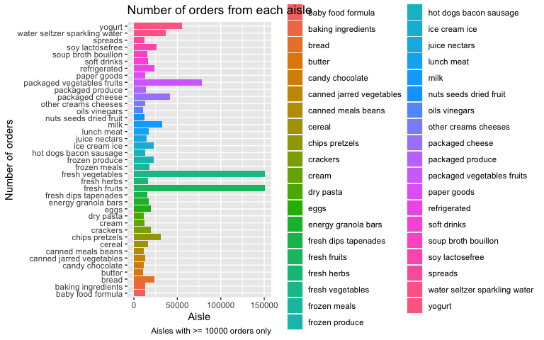
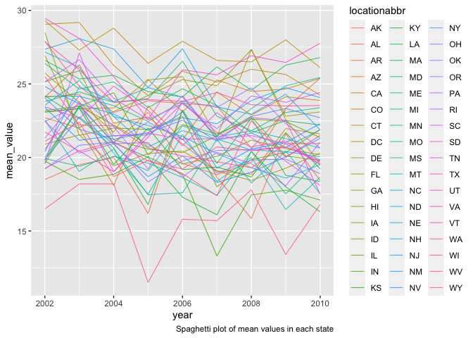
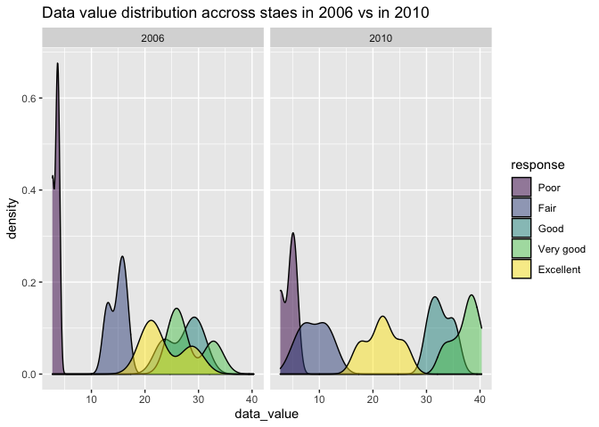
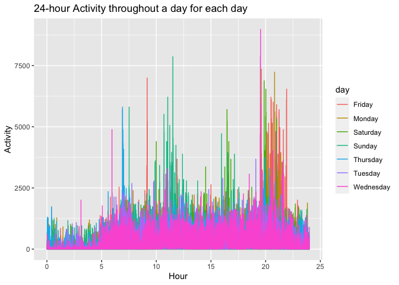

P8105 hw3
================
Jiacheng Wu
10/17/2021

``` r
library(tidyverse)
```

## Problem 1

Loading data.

``` r
library(p8105.datasets)
data("instacart")
```

Write a short description of the dataset, noting the size and structure
of the data, describing some key variables, and giving illstrative
examples of observations.

This dataset has more than 3 million instacart orders. There are 1384617
rows and 15 columns. Variables in the table include order\_id,
product\_id, add\_to\_cart\_order, reordered, user\_id, eval\_set,
order\_number, order\_dow, order\_hour\_of\_day,
days\_since\_prior\_order, product\_name, aisle\_id, department\_id,
aisle, department.

1.1 How many aisles are there, and which aisles are the most items
ordered from?

``` r
aisle_n = 
  instacart %>% 
  count(aisle, name = "n_of_orders") %>% 
  arrange(desc(n_of_orders))
```

There are 134 aisles. The aisle that are ordered most from is aisle
`fresh vegetables`.

1.2. Make a plot that shows the number of items ordered in each aisle,
limiting this to aisles with more than 10000 items ordered. Arrange
aisles sensibly, and organize your plot so others can read it.

``` r
aisle_n %>%  
  filter(n_of_orders >= 10000) %>% 
  ggplot(aes(x = n_of_orders, y = aisle, fill = aisle)) +
  geom_bar(stat = "identity") +
  labs(
    title = "Number of orders from each aisle",
    x = "Aisle",
    y = "Number of orders",
    captions = "Aisles with >= 10000 orders only"
  )
```

<!-- -->

1.3 Make a table showing the three most popular items in each of the
aisles “baking ingredients”, “dog food care”, and “packaged vegetables
fruits”. Include the number of times each item is ordered in your table.

``` r
instacart  %>%  
  filter(aisle == c("baking ingredients", "dog food care", "packaged vegetables fruits")) %>% 
  group_by(aisle, product_name) %>% 
  summarize(n_of_orders = n()) %>% 
  arrange(desc(n_of_orders)) %>% 
  do(head(., n = 3)) %>% 
  knitr::kable(
    caption = "Three most popular products from the three most popular aisles"
  )
```

    ## `summarise()` has grouped output by 'aisle'. You can override using the `.groups` argument.

| aisle                      | product\_name                                   | n\_of\_orders |
|:---------------------------|:------------------------------------------------|--------------:|
| baking ingredients         | Light Brown Sugar                               |           157 |
| baking ingredients         | Pure Baking Soda                                |           140 |
| baking ingredients         | Organic Vanilla Extract                         |           122 |
| dog food care              | Organix Grain Free Chicken & Vegetable Dog Food |            14 |
| dog food care              | Organix Chicken & Brown Rice Recipe             |            13 |
| dog food care              | Original Dry Dog                                |             9 |
| packaged vegetables fruits | Organic Baby Spinach                            |          3324 |
| packaged vegetables fruits | Organic Raspberries                             |          1920 |
| packaged vegetables fruits | Organic Blueberries                             |          1692 |

Three most popular products from the three most popular aisles

1.4 Make a table showing the mean hour of the day at which Pink Lady
Apples and Coffee Ice Cream are ordered on each day of the week; format
this table for human readers (i.e. produce a 2 x 7 table).

``` r
instacart %>% 
  filter(product_name == c("Pink Lady Apples", "Coffee Ice Cream")) %>% 
  group_by(product_name, order_dow) %>% 
  summarise(mean_hour = mean(order_hour_of_day)) %>% 
  mutate(order_dow = recode(order_dow,
                            "0" = "Monday",
                            "1" = "Tuesday",
                            "2" = "Wednesday", 
                            "3" = "Thursday",
                            "4" = "Friday",
                            "5" = "Saturday",
                            "6" = "Sunday"
                             )
         ) %>% 
  pivot_wider(
    names_from = order_dow,
    values_from = mean_hour
  ) %>% 
  knitr::kable(
    digit = 2,
    caption = "Mean hour of order of a day"
  )
```

    ## Warning in product_name == c("Pink Lady Apples", "Coffee Ice Cream"): longer
    ## object length is not a multiple of shorter object length

    ## `summarise()` has grouped output by 'product_name'. You can override using the `.groups` argument.

| product\_name    | Monday | Tuesday | Wednesday | Thursday | Friday | Saturday | Sunday |
|:-----------------|-------:|--------:|----------:|---------:|-------:|---------:|-------:|
| Coffee Ice Cream |  13.22 |   15.00 |     15.33 |    15.40 |  15.17 |    10.33 |  12.35 |
| Pink Lady Apples |  12.25 |   11.68 |     12.00 |    13.94 |  11.91 |    13.87 |  11.56 |

Mean hour of order of a day

## Problem 2

Laad “BRFSS” data

``` r
data("brfss_smart2010")
brfss = brfss_smart2010
```

Tidy data

``` r
brfss = 
 brfss %>% 
  janitor::clean_names() %>% 
  filter(topic == "Overall Health") %>% 
  mutate(
    response = factor(response,
                      levels = c("Poor", "Fair", "Good", "Very good", "Excellent"),
                      ordered = TRUE)
  )
```

Answer the following questions.

2.1 In 2002, which states were observed at 7 or more locations? What
about in 2010?

``` r
data_2002 = 
  brfss %>% 
  filter(year == 2002) %>% 
  group_by(locationabbr) %>% 
  summarise(n_of_locations = n()/5) %>% 
  filter(n_of_locations >= 7) %>% 
  arrange(n_of_locations)

data_2002 %>% 
  knitr::kable(
    caption = "Number of locations in states with 7 or more locations in 2002"
  )
```

| locationabbr | n\_of\_locations |
|:-------------|-----------------:|
| CT           |                7 |
| FL           |                7 |
| NC           |                7 |
| MA           |                8 |
| NJ           |                8 |
| PA           |               10 |

Number of locations in states with 7 or more locations in 2002

``` r
data_2010 = 
  brfss %>% 
  filter(year == 2010) %>% 
  group_by(locationabbr) %>% 
  summarize(n_of_locations = n()/5) %>% 
  filter(n_of_locations >= 7) %>% 
  arrange(n_of_locations)
data_2010 %>% 
  knitr::kable(
    caption = "Number of locations in states with 7 or more locations in 2010",
  )
```

| locationabbr | n\_of\_locations |
|:-------------|-----------------:|
| CO           |                7 |
| PA           |                7 |
| SC           |                7 |
| OH           |                8 |
| MA           |                9 |
| NY           |                9 |
| NE           |               10 |
| WA           |               10 |
| CA           |               12 |
| MD           |               12 |
| NC           |               12 |
| TX           |               16 |
| NJ           |               19 |
| FL           |               41 |

Number of locations in states with 7 or more locations in 2010

In 2002, there were `6` states with 7 or more locations observed. They
are CT, FL, NC, MA, NJ, PA. In 2010, there were `14` states with 7 or
more locations observed. They are CO, PA, SC, OH, MA, NY, NE, WA, CA,
MD, NC, TX, NJ, FL.

2.2 Construct a dataset that is limited to Excellent responses, and
contains, year, state, and a variable that averages the data\_value
across locations within a state. Make a “spaghetti” plot of this average
value over time within a state

``` r
excellent_response <-   
  brfss %>% 
  filter(response == "Excellent") %>% 
  group_by(year, locationabbr) %>% 
  summarize(
    mean_value = mean(data_value, na.rm = TRUE)
  )
```

    ## `summarise()` has grouped output by 'year'. You can override using the `.groups` argument.

``` r
excellent_response %>% 
  ggplot(aes(x = year, y = mean_value, color = locationabbr)) +
  geom_line(size = .3) +
  labs(
    caption = "Spaghetti plot of mean values in each state"
  )
```

<!-- -->

2.3 Make a two-panel plot showing, for the years 2006, and 2010,
distribution of data\_value for responses (“Poor” to “Excellent”) among
locations in NY State.

``` r
brfss %>% 
  filter(year == c("2006", "2010") & locationabbr == "NY") %>% 
  ggplot(aes(x = data_value, fill = response)) + 
  geom_density(alpha = .5) +  
  facet_grid(. ~ year) +
  labs(
    title = "Data value distribution accross staes in 2006 vs in 2010"
  )
```

    ## Warning in year == c("2006", "2010"): longer object length is not a multiple of
    ## shorter object length

<!-- -->

## Problem 3

Load data

``` r
accel = read_csv("./data/accel_data.csv")
```

3.1 Tidy, and otherwise wrangle the data.

``` r
accel_df = 
  accel %>% 
  janitor::clean_names() %>% 
  pivot_longer(
    activity_1:activity_1440,
    names_prefix = "activity_",
    names_to = "minute",
    values_to = "activity"
  ) %>% 
  mutate(
    minute = as.numeric(minute),
    dow = ifelse(day == weekdays(as.Date("2021-10-18") + 0:1), "weekend", "weekday")
  ) %>% 
  relocate(week, day_id, day, dow)
```

The variables in the dataset are week, day\_id, day, dow, minute,
activity. There are 50400 observations.

3.2 Traditional analyses of accelerometer data focus on the total
activity over the day. Using your tidied dataset, aggregate accross
minutes to create a total activity variable for each day, and create a
table showing these totals. Are any trends apparent?

``` r
total_activity = 
  accel_df %>% 
  group_by(week, day) %>% 
  summarise(sum_of_activity = sum(activity))

total_activity %>% 
  pivot_wider(
     names_from = "day", 
     values_from = "sum_of_activity"
  ) %>% 
  knitr::kable(
    caption = "Total activity in a day for each day"
  )
```

| week |   Friday |    Monday | Saturday | Sunday | Thursday |  Tuesday | Wednesday |
|-----:|---------:|----------:|---------:|-------:|---------:|---------:|----------:|
|    1 | 480542.6 |  78828.07 |   376254 | 631105 | 355923.6 | 307094.2 |    340115 |
|    2 | 568839.0 | 295431.00 |   607175 | 422018 | 474048.0 | 423245.0 |    440962 |
|    3 | 467420.0 | 685910.00 |   382928 | 467052 | 371230.0 | 381507.0 |    468869 |
|    4 | 154049.0 | 409450.00 |     1440 | 260617 | 340291.0 | 319568.0 |    434460 |
|    5 | 620860.0 | 389080.00 |     1440 | 138421 | 549658.0 | 367824.0 |    445366 |

Total activity in a day for each day

The total daily activity is extremely low on the Saturdays and Sundays
of Week 4 and 5.

3.3 Accelerometer data allows the inspection activity over the course of
the day. Make a single-panel plot that shows the 24-hour activity time
courses for each day and use color to indicate day of the week. Describe
in words any patterns or conclusions you can make based on this graph.

``` r
accel_df %>% 
  ggplot(aes(x = minute / 60, y = activity, color = day)) + 
  geom_line() + 
  labs(
    x = "Hour",
    y = "Activity",
    title = "24-hour Activity throughout a day for each day"
  )
```

<!-- -->

The graph indicates that from approximately hour 22:00 to hour 06:00,
the activity is lower than that of the rest of the day. Also, activity
in weekdays are higher than activities in weekends.
